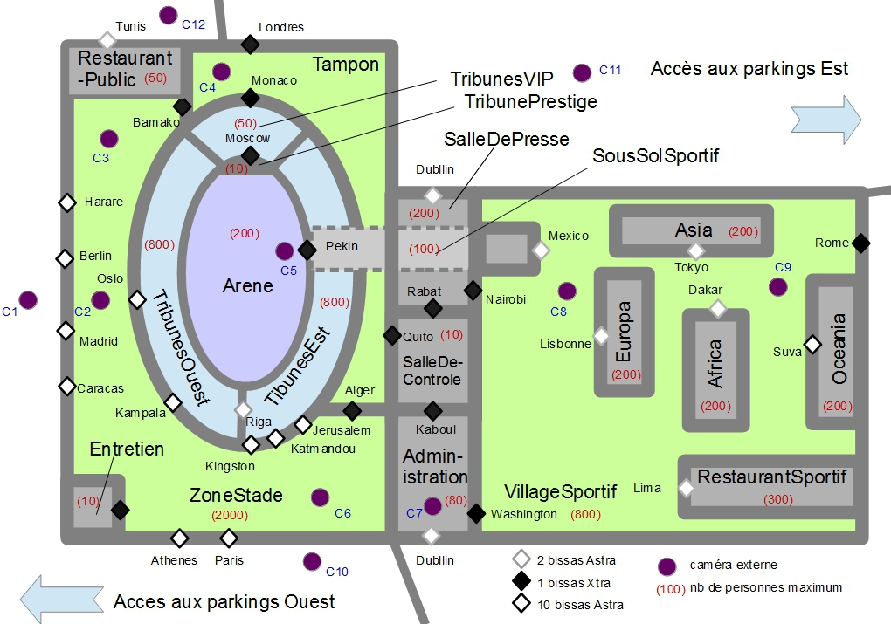
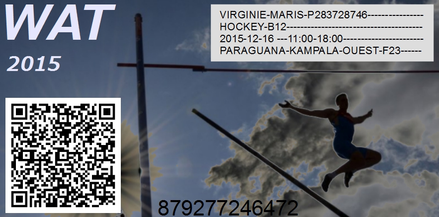
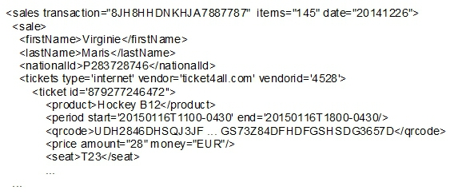

CR002
=====
:Date: 2015-01-05-08h-22h
:Type: Reunion
:Lieu: Paraguana-Competis
:PartiesPrenantes: ABI, JDR, PSO, AGO
:Organisateur: ABI
:Rapporteur: KWG
:Presents: ABI, JDR, PSO, AGO
:Objectifs: Cas d'étude Paraguana/WAT 2015

.. attention::
    Ce compte rendu est un *document de travail* et n'est pas contractuel.

#. Nouvel intervenant:
#. _ Apito GUARACARUMBO (AGO) - Competis, San Juan de Los Morros
#. La réunion a eu lieu sur le site de Paraguana, guidé par AGO.
#. Le site n'est actuellement pas équipé.
#. Il devra l'être pour la compétition WAT 2015 qui aura lieu en novembre 2015.
#. Grâce aux bissas, cette installation temporaire a été considérée comme viable par Batemis.
#. Batemis et Bissis seront les seuls à pouvoir équiper des sites temporaires conformes à EAN1225.
#. Un plan des installations a été fourni par Competis.
#. A partir de la visite du site et de ce plan, un premier plan sécurité a été établi.
#. Les différents points d'accès et le nombre des bissas a été déterminé par Batemis.
#. De même pour le positionnement des caméras et de la salle de contrôle.

    Fig1: Paraguana, un exemple de site devant être géré par CyberBatiment

12. Les différentes zones du site ont été représentées sur le plan sécurité.
#. Par contre les bâtiments, installations et autres espaces non sécurisés n'y sont pas.
#. De même pour les entrées de véhicules et autres entrées gérées par des gardiens en poste.
#. Les différents types de bissas ont été choisi en fonction du niveau de sécurité à atteindre.
#. Il est rappellé qu'une présentation des bissas aura lieu à Berlin - Bissis.
#. Différents groupes de badgeurs devront être définis.
#. Par exemple les "spectateurs" auront des badges courts (temporaires).
#. Ils ne pourront accéder qu'à la zone du stade et à la tribune correspondant à leur billet.
#. Cette autorisation n'est valide que pour la période correspondant à l'épreuve choisie.
#. Un exemple de billet a été fourni par Competis et reproduit ci-dessous.

.. _Fig2:

    Fig2: Exemple de billet faisant office de badge court grâce au QR code

22. Pendant WAT 2015 les "sportifs" accéderont au village sportif, au restaurant, et à leur bâtiment.
#. Ils pourront aussi aller en salle de presse et à l'administration de 8h à 17h.
#. Par contre l'accès au sous sol sportif et à l'arène ne leur sera pas autorisé tout le temps.
#. Ce sera uniquement le cas si une épreuve les concernent.
#. Par exemple si une équipe perd est éliminée via un match, elle ne pourra plus participer à la suite.
#. Un administrateur de groupe doit donc pouvoir facilement changer les autorisations d'un groupe.
#. Différents autres groupes de badgeurs ont été évoqués dans ce cas d'étude.
#. Par exemple les administrateurs et les journalistes ont chacun leurs zones.
#. Les gardiens peuvent aller dans toutes les zones dont la salle de contrôle.
#. Ils peuvent par ailleurs faire passer une personne (une seule) avec leur badge.
#. C'est utile par exemple pour les V.I.P.s qui vont dans la tribune V.I.P.s. ou Prestige.
#. C'est utile également lorsqu'ils doivent débloquer quelqu'un suite à un incident.
#. Même si différents groupes de badgeurs ont été identifiés, d'autres pourraient apparaître.
#. Il doit être possible pour un superviseur de créer de nouveaux groupes.
#. Par contre chaque groupe devra être administré par un administrateur.
#. Par exemple les administrateurs pour les sportifs pourront créer des badges longs pour eux.
#. Ils devront aussi pouvoir changer leurs autorisations en fonction des résultats sportifs, etc.
#. Les administrateurs de presse s'occuperont des badges (courts ou longs) pour les journalistes, etc.
#. L'émission de badges courts pour les spectateurs par contre seront gérés de manière automatique.
#. Dans une compétition telle que WAT 2015 on attend en effet environ 100 000 spectateurs.
#. Plus de 400 000 billets seront sans doute émis (mais par forcément utilisés).
#. CyberCompetition_ (par Competis) sera en charge de l'émission des billets.
#. Pour les spectateurs les badges courts prendront la forme de QR codes sur les billets vendus (cf Fig2_)
#. Le fichier ci-dessous a été fourni par Competis.

    Fig3: Exemple de fichier généré par Competis - Exemple Competis2015_01_05

46. Seules certaines informations seront nécessaires dans le cadre de CyberBatiment.
#. Il a été convenu qu'un format XML devrait être défini dans ce cadre.
#. Des logiciels externes (e.g. CyberCompetition) devront pouvoir ajouter des badges courts.
#. Ceci devra pouvoir se faire via un via un web service sécurisé.
#. Competis écrira un wrapper pour appeler ce service une fois celui-ci défini.
#. En conclusion, la visite sur le site de Paraguana a été très instructive.
#. Il a cependant été jugé souhaitable de considérer un autre type de site.
#. Le risque soulevé par Batemis est de produire encore une solution ad-hoc.
#. CyberBatiment doit être aussi général et flexible que possible.

.. ............................................................................attention::

.. _CyberCompetition: http://CyberCompetition.readthedocs.org
