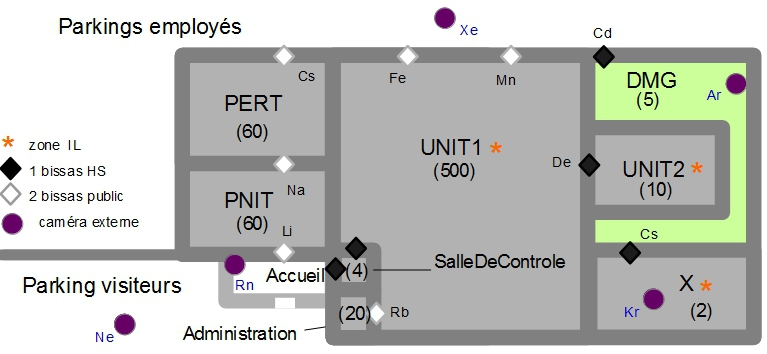

CR003
=====
:Date: 2015-01-06-18h-21h
:Type: Reunion
:Lieu: Morrocoy-Chimiotis
:PartiesPrenantes: ABI, JDR, PSO, AGO
:Organisateur: ABI
:Rapporteur: KWG
:Presents: ABI, JDR, PSO, AGO
:Objectifs: Paraguana/WAT 2015 comme cas d'étude

#. Gràce au contact d'AGO, une visite du site chimique de Morrocoy a été organisée.
#. Chimiotis, la société gérante désire s'aligner sur la norme EAN1225 en 2016.
#. Il s'agit donc d'un prospect chaud pour CyberBatiment.
#. Un premier plan securité de l'usine a été créé à partir des informations fournies par Chimiotis.

    Figure 1: Potentiel plan securité pour le site de Morrocoy

#. Contrairement au site Paraguana le site Morrocoy n'est pas temporaire.
#. Par ailleurs le nombre de groupes est beaucoup plus faibles.
#. Le nombre de badgeurs par groupes va de 1 à 300 environ.
#. Ceci dit les membres de chaque groupe sont assez stables.
#. Les autorisations sont également plutot stables d'aprés Chimiotis.
#. En effet le personnel de l'usine ne change que rarement.
#. En fait il semble qu'un administrateur pourrait gérer tous les groupes.
#. Cela contraste avec le site de Paraguana où plusieurs administrateurs doivent gérer un même groupe.
#. Les ouvriers font les 3 x 8 mais de manière régulière sur 3 mois.
#. Actuellement l'usine est gardée par 10 gardiens, 24/24.
#. Avec CyberBatiment on estime que 4 gardiens seraient suffisant, d'ou 12 en 3x8.
#. Comme pour les autres sites, le serveur de contrôle serait installé dans la salle de contrôle.
#. Une des préoccupations de Chimiotis est d'être conforme à l'article 17 de la norme EAN1225.
#. Cet article concerne les règles à appliquer en cas d'incendie dans une zone.
#. Tous les points d'accès doivent être ouverts dans les zones "Incendie Libre" (IL).
#. Dans les autres zones, un incident système est seulement déclenché.
#. Les gardiens peuvent ensuite prendre la décision de débloquer tel ou tel point d'accès.
#. Par contre pour une zone IL les points d'accès doivent automatiquemet s'ouvrir jusqu'à l'exterieur.
#. Il faudra donc prendre en compte les systèmes à incendie et les interfacer avec CyberBatiment.
#. Renseignement pris, il n'existe que 4 zones IL à Paraguana: les différentes tribunes.

.............................................................................

#. Les points d’accès permettent de rentrer et de sortir des différentes zones.
#. C’est à cet endroit qu’il y a des points de contrôles qui permettent de vérifier les allées et venues.
#. Généralement les points d’accès sont à double sens.
#. Mais parfois certains points d’accès sont en sens unique, soit entrée, soit sortie.
#. Lors de gros événements sportifs par exemple on sépare les flux d’entrée et de sortie.
#. D’un point de vue matériel le contrôle d’accès peut se faire de différentes manières.
#. Dans certains cas Batemis installe des tourniquets qui fonctionnent avec des badges.
#. Avec ces systèmes le badgeur à 6 secondes pour passer.
#. Pour certaines zones plus sensibles les points de contrôles sont matérialisés par des bissas.
#. Il s’agit de sas à deux portes assemblés dans l’antenne chinoise de Batemis.
#. En plus des portes qui sont incassables, ces équipements contiennent des afficheurs.
#. Ces afficheurs indiquent le nombre de secondes restant avant l’ouverture de la deuxième porte.
#. Ce genre de matériel est utilisé par exemple dans les banques.
#. Une autre solution classique et moins couteuse est la suivante.
#. A priori c’est celle qui sera retenu dans un premier temps pour le premier incrément de CyberBatiment.
#. Un lecteur de badge avant la porte permet de débloquer la porte.
#. Deux capteurs permettent de vérifier le sens de passage.
#. Un mécanisme adéquat permet de vérifier qu'une seule personne passe à la fois.
#. Dans ces systèmes la porte se referme 3 secondes après le passage.
#. S’il n’y a pas de passage la porte se referme au bout de 10 secondes.
#. Un afficheur permet de faire connaître aux utilisateurs si le point d’accès est actif ou fermé.
#. La procédure est la suivante avec ce genre de système.
#. Pour accéder à un bâtiment un utilisateur présente son badge au lecteur.
#. Quand il y est autorisé, il passe en ouvrant la porte.
#. S’il s’agit d’une porte automatique celle-ci va s’ouvrir automatiquement.
#. Le lecteur affiche son état d'activité, lit le badge, transmet les infos au système central.
#. Il affiche le résultat de la validation suivant les informations du badgeur.
#. Le système central analyse, valide la demande, et envoie les signaux adéquats.
#. Il s’agit de l’affichage, du déblocage, de la fermeture et reblocage.
#. Il peut aussi y avoir différents types d’alarmes.
