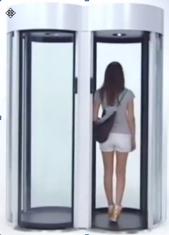
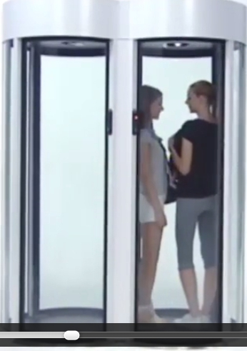

CR004
=====

:Date: 2015-01-15-10h-16h
:Type: Réunion
:PartiesPrenantes: KWG, CMS, YBI, MPA, ZSH
:Lieu: Berlin-Bissis
:Organisateur: KWG
:Rapporteur: KWG
:Presents: KWG, CMS, YBI, MPA, ZSH
:Objectifs: Présentation de l'offre matérielle de Bissis

#. Nouvelles parties prenantes:
#. _ Clarissa Maris (CMS) - Bissis, Berlin
#. _ Yohav El Benali (YBI) - Bissis, Berlin
#. La réunion a eu lieu dans les locaux de Bissis.
#. Bissis est sur le point de commercialiser des sas de sécurité révolutionnaires.
#. Ces systèmes physiques seront prochainement commercialisés sous le nom de *Bissas*.
#. Bissis souhaite accélérer la mise sur le marché des bissas, mais ne dispose pas d'équipe logicielle.
#. Bissis souhaite donc intégrer le consortium et participer à l'élaboration de CyberBatiment.
#. Il est entendu que Bissis fournira tout le matériel de sécurité.
#. Par contre un problème est vite apparu pendant la réunion.
#. Il sera impossible de voir les bissas avant au moins deux mois, et cela pour des problèmes de confidentialité.
#. Vu les très nombreuses innovations, de multiples brevets sont en court d'acquisition et ce procédé est long.
#. La direction ne souhaite prendre aucun risque de fuites et même en interne seuls certains employés (e.g. YBI) ont une vision globale des bissas tel qu'ils seront présentés dans quelques mois.
#. Après quelques échanges et discussions animées, il est apparu que ce ne devrait cependant pas être un problème pour CyberBatiment.
#. Bissis fournira des simulateurs physiques et électroniques pour que puissent commencer les tests lorsque nécessaires.
#. Toutes la partie logicelle sur le serveur de contrôle (et évidemment sur le serveur d'applications) pourront être réalisées en amont gràce à la simulation des signaux envoyés par les bissas et les caméras.
#. Batemis qui travaille depuis longtemps avec Bissis est confiant dans cette démarche.
#. L'utilisation d'une spécification UML a été soulignée comme un point essentiel dans ce contexte tendu.
#. En ce qui concerne les fonctionalités des bissas, Bissis a proposé de se baser sur l'étude des systèmes basés proposés par la concurrence.
#. Les bissas ressembleront *par certains cotés* au système "Cilindro Bibussola" de AllUserIndustrie_:

.. _CilindroBibussola :

    Fig1: *"CILINDRO BIBUSSOLA"* par AllUserIndustrie_ (cf |videoBibussola|)

21. Le Bibussola n'est là qu'à titre d'illustration; les bissas sont très différents.
#. Des groupes de 2 à 10 bissas peuvent être assemblés par point d'accès.
#. Le matériel est extrêment performant (si les contrôles logiciels suivent).
#. Ceci permet des flux important à un même point d'accès (jusqu'à 100 passages/mn).
#. Les bissas peuvent être installés temporairement sur n'importe quel type de site.
#. Ce sera le seul produit sur le marché offrant cette possibilité.
#. Cela répond au besoin à Paraguana pour WAT2015.
#. Les bissas sont symétriques et possèdent systèmatiuement des lecteurs des deux cotés (contrairement aux Bibussolas montrés dans la vidéo).
#. Dans le cadre de la norme EAN1225 les deux sens doivent donner lieu à des événements d'accès.
#. On doit en effet a tout moment être capable de savoir dans quelle zone se trouve tout badgeur.
#. Les lecteurs des bissas sont polyvalents et permettent plusieurs types d'identification.
#. Ils lisent différents types de badges courts, par exemple des QR codes.
#. Ils peuvent lire également différents types de badges longs comme des cartes magnétiques (a distance jusqu'à 1m ou via une insertion classique).
#. Quelque soit le type de badge, le signal envoyé au serveur de contrôle est toujours le même.
#. Il comporte toujours un code sur 256 bits.
#. Les 4 premiers bits correspondent au numéro du bissas dans le point d'accès.
#. Les 16 bits suivant encodent le numéro du point d'accès dans le site.
#. Les 4 bits suivant décrivent le type de lecteur responsable de la détection.
#. Les bits restants contiennent entre autre le "bCode" (code badge).
#. Les lecteurs sont équipés de deux leds (une rouge et verte) pouvant être programmées.
#. Au point de vue des portes, chacune peut être programmée de manière indépendante.
#. Des détecteurs de chaque coté permettent simplement d'envoyer des signaux lorsqu'une porte arrive en position ouverte ou en position fermée.
#. Tout comme le CilindroBibussola_ les bissas possèdent un détecteur de présence à l'intérieur du sas.
#. Ce détecteur retourne un signal A, B ou C selon le nombre de personnes (0, 1 ou plus).
#. Cela permettera de programmer une fonction d'*anti tailgaiting* sur les serveurs de controle.

    Fig1: Tailgaiting (cf |videoBibussola| s52)

44. En fait les bissas ne comportent que des aspects matériels et électroniques.
#. Toute la programmation de la partie logicielle devra être faite dans le cadre de CyberBatiment.
#. Cela devra se faire sur le serveur de contrôle en fonction des signaux émis par les bissas.
#. Batemis propose deux types de bissas, les bissas Astra et les bissas Xtra.
#. Les bissas Astra sont destinés à recevoir un public important.
#. C'est pour cela que Batemis préconisait leur utilisation sur le site de Paraguana pour l'accès au stade notamment.
#. Les bissas Astra permettent entre autre d'organiser des files d'attentes uniques par point d'accès.
#. Ils sont munis d'un feu visible depuis la file indiquant l'état du bissas (vert, orange, rouge, orange, vert).
#. Ce feu tricolore permet de montrer avec 2 secondes d'anticipation le prochain bissas Astra a priori disponible (orange puis vert).
#. Pour ce faire, un détecteur de présence à l'exterieur de chaque coté fait passer le feu au orange lorsqu'un badgeur arrive à proximité.
#. Ceci permet de montrer en avance que quelqu'un est sur le point d'entrer ou sortir et que le bissas n'est pas libre.
#. En fait, une fois de plus, ce genre de fonctionalité devra être programmé sur le serveur de contrôle.
#. Le bissas est juste en charge d'émettre les signaux correspondant le moment venu.
#. Batemis souligne à ce propos le fait que différents scénario devront donner lieu à à la détection d'incident système.
#. C'est le cas par exemple si un badgeur ne sort pas du sas au bout de 8 secondes.
#. C'est également le cas si quelqu'un bloque la porte avec un pied, etc.
#. Tous ces incidents sont dits systèmes dans la mesure ou c'est le système (CyberBatiment) qui doit les détecter.
#. D'autres évenements, les évenements gardiens, sont eux créés par les gardiens.
#. C'est le cas par exemple lorsqu'un gardien voit quelqu'un sauter par dessus un mur sécurité.
#. Ou lorsqu'un gardien constate (par exemple sur le site de Moroccoy) des fumées anormales dans une zone.
#. Tous ces incidents devront être gardé dans l'historique.
#. La discussion a été ensuite recentrée sur la présentation du matériel proposé par Bissis puisqu'il s'agit de l'objectif de la réunion.
#. Batemis propose aussi des bissas haute sécurité, les bissas Xtra.
#. Il permette d'être sûr (à 98%) que le badgeur est bien la personne associée au badge.
#. La personne ne peut en effet sortir du sas qu'après avoir effectué une identification physique.
#. Cette identification physique se fait à l'intérieur du sas, après l'identification badge à l'entrée.
#. L'identification physique consiste soit en une empreinte digitale, soit en une reconnaissance faciale.
#. Si la personne n'est pas autorisée un incident sera généré par le bissas Xtra.
#. Il en sera de même si le détecteur de métaux intégré dans les Xtra se déclenche.
#. Le badgeur sera alors bloqué dans le sas et devra attendre qu'un gardien vienne le débloquer.
#. Une fois de plus Bissis propose le matériel pour réalisé cela, mais les fonctions devront être réalisées sur le serveur de contrôle en fonction des signaux émis par les bissas.
#. Evidemment les digitCodes et faceCodes (transmis respectivement par le lecteur d'empreinte digitale et le lecteur facial), devront être comparés aux données disponibles sur le serveur d'applications.
#. Dans CyberBatiment ce sont les administrateurs de groupes qui seront chargé, en plus de la délivrance des badges, de collecter les empreintes digitales et les portraits des badgeurs haute sécurité.
#. De plus des caméras peuvent être installées à différents endroits sur le site.
#. Les gardiens doivent pouvoir à tout moment les ré-orienter à distance.
#. Les bissas et les caméras sont reliés via des liaisons RFC 321 au serveur de contrôle du site.
#. Il y a une salle de contrôle par site; elle contient le serveur de contrôle.
#. Seul les gardiens ont accès à cette zone.
#. Dans la salle de contrôle ils disposent de postes CR600 relié via TCP/IP au serveur de contrôle du site.
#. Les gardiens disposent également tous de mobiles MN100 (smartphones spécialisés).
#. Les MN100 leur permettent de se déplacer entre les zones en restant connectés.

.. ............................................................................

.. _AllUserIndustrie: http://www.archiexpo.com/prod/alluser-industrie/sliding-doors-commercial-buildings-security-automatic-52110-624140.html#product-item_142100

.. |videoBibussola| replace::

    :download:`VideoBibussola <./media/videoBibussola.mp4>`

.. _`QR codes`: http://en.wikipedia.org/wiki/QR_code
